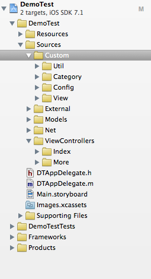

##1.安装方法

安装方法:    

`clone https://github.com/RobinWuDev/Templates.git`

然后将Templates目录放在

`~/Library/Developer/Xcode`目录下

如果已经有Templates目录了，则将合并两个目录就可以了。

##2.模板介绍

###1.RobinWuDevSimple.xctemplate
--Sources(该目录存放项目所有的代码文件)

----Custom(该目录存放项目自定义的文件,如自定义控件，扩展类。)

------Category(该目录存放项目自定义的扩展类文件)

------Config(该目录存放项目配置文件)

------View(该目录存放项目自定义的控件)

------Util(该目录存放项目的自定义工具类)

----External(该目录放第三方的代码，如果自己本身有自己的代码库，也应该放在这里面)

----Models(该目录放模型文件)

----Net(该目录放网络层代码)

----ViewControllers(该目录放控制器文件,下面的目录根据你的项目模块进行划分,例如首页，更多)

------Index(该目录放首页模块的控制器文件，子目录可以再分，TableView的Cell也可以放在这个目录下)

------More(该目录放更多模块的控制器文件，子目录可以再分，TableView的Cell也可以放在这个目录下)

--Resources(放资源文件,如果是使用Xcode5以下版本，将图片放在这里,子目录可以根据需要划分,Xcode5以上的文件放在Images.xcassets中)

----Document(放文档文件，例如pdf文件，txt文件等)

